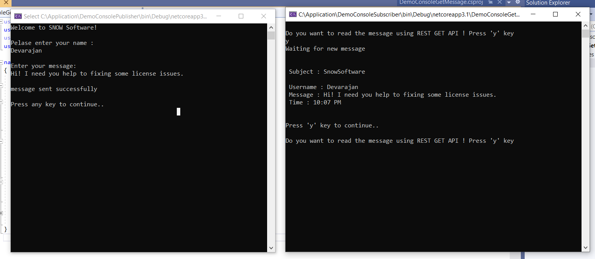
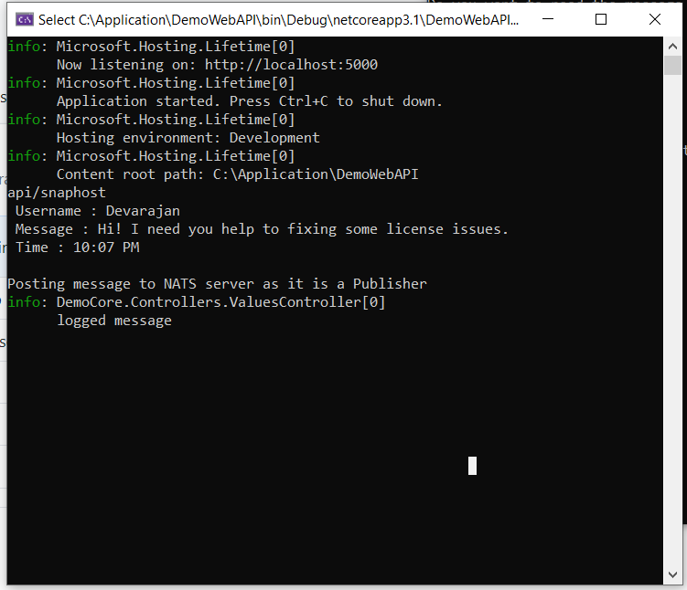

# Test program by Devarajan!

The assignment is about writing a messaging-based chat client which interacts with other clients through the NATS messaging system.
All development should be done using either Go, C# or C++. The expected outcome is a zip file containing that source code and a README.md file describing how to compile and use the application. 

Write a simple chat client which accepts messages from a user and sends these to a NATS subject using the PUB/SUB pattern. The client should also receive messages that comes in on the subject and output these to the console. Each message should be tagged with the username of the client that sent them and a timestamp.

*Introduction*
----------
There are three console applications has been used for this test program.

**1. DemoConsolePostMessage** (This is used to accept the message from the user and publish it to NATS.

**2. DemoWebAPI** (Its .Net Core Web API used for communicate with NATS broker to POST and GET the messages)

**3. DemoConsoleGetMessage**  (This is another console application which send a GET request to Web API and returns the response to you)

*Required dependencies*
-----------------
1. NATS.Client(Nuget Package Manager) - It has to be added/referred to all there three applications.

2. Microsoft.AspNet.WebApi.Client(Nuget Package Manager) ,  Install to the DemoConsolePostMessage application..

*How to Run the applications*
-------

#Step 1 :
-------
Run  --> NATS Server exe which downloaded from NATS and run the service with the port number 4222,
eg: *nats://localhost:4222

Commands to create service in Windows, but i used Docker to run the server.

* sc.exe create nats-server binPath= "%Filepath%\nats-server.exe -p 4222"
* sc.exe start nats-server

#Step 2 :
------
Open DemoWebAPI solution in Visual Studio 2019(which i used to develop) ,  and keep the window aside. You can also see the output when its called.

#Step 3 :
------
Open and Run --> DemoConsolePostMessage application and pass your name and message
(Once you entered the inputs, itcalls the API which accepts the message from request body and post them into NATS client)

#Step 4 :
--------
Open and run DemoConsoleGetMessage application and see the output of message that you sent.

####Output
-----------

####Output of API
---------------

